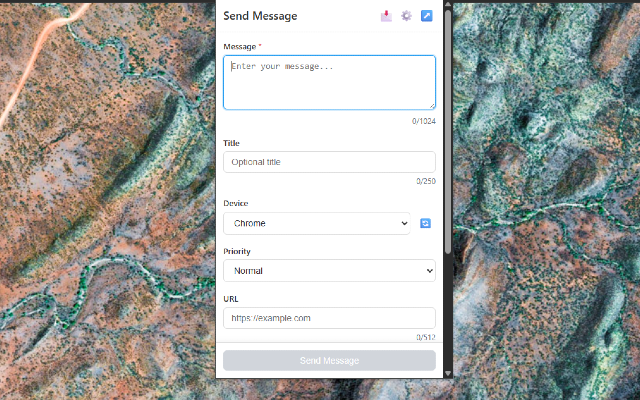
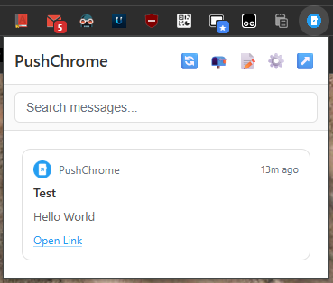

# PushChrome

An unofficial [Pushover](https://pushover.net) browser extension — receive, view, and send push notifications directly from your browser.

<p>
  
  &nbsp;&nbsp;
  
</p>

## Features

- **Receive Messages** — Real-time message delivery via WebSocket streaming or configurable polling intervals
- **Send Messages** — Compose and send notifications with priority, sound, device targeting, and URL attachments
- **Desktop Notifications** — Native notifications with app icons, priority styling, and emergency acknowledgment
- **Context Menu Integration** — Right-click to send the current page URL or selected text to Pushover
- **Send-Only Mode** — Use the extension to send messages without a Pushover Desktop license
- **Pop-Out Window** — Open the message list in a standalone resizable window
- **Offline Message Cache** — Messages are stored locally
- **Unread Tracking** — Badge count and visual indicators for unread messages
- **2FA Support** — Full two-factor authentication support during login

## How It Works

PushChrome uses two Pushover APIs:

1. **[Open Client API](https://pushover.net/api/client)** — For receiving messages. Requires a Pushover license. The extension logs in with your email/password, registers a device, then fetches messages. Messages are deleted from Pushover's servers after retrieval and cached locally in `chrome.storage`.

2. **[Message API](https://pushover.net/api)** — For sending messages. Requires an application API token and your user key. No license needed.

### Operating Modes

| Mode | Login Required | API Token Required | Capabilities |
|------|:-:|:-:|---|
| **Full** | ✓ | ✓ | Receive + send messages |
| **Receive-Only** | ✓ | ✗ | Receive messages only |
| **Send-Only** | ✗ | ✓ | Send messages only (no license needed) |

### Message Delivery

Messages can be delivered in two ways:

- **WebSocket Streaming** — Instant delivery via a persistent connection to `wss://client.pushover.net/push`. Auto-reconnects on connection drops and service worker restarts.
- **Polling** — Configurable intervals using browser alarms.

## Prerequisites

- **Pushover account** — [Sign up at pushover.net](https://pushover.net)
- To **receive** messages: a [Pushover Desktop license](https://pushover.net/clients/desktop)
- To **send** messages: a [Pushover application/API token](https://pushover.net/apps/build)

## Installation

[](https://chromewebstore.google.com/detail/pushchrome/fbkhhdgdjaklianangpcfmeplipeepnj)

To install it manually as an unpacked extension:

1. Download the `zip` from the [latest release](https://github.com/RafhaanShah/PushChrome/releases)
2. Open the browser extension menu, e.g. `chrome://extensions`
3. Enable **Developer mode** (toggle in the top-right corner)
4. Click **Load unpacked** and select the cloned `PushChrome` directory
5. The PushChrome icon will appear in your browser toolbar

### Setup

- **To receive messages:** Click the extension icon and log in with your Pushover email and password and register your browser.
- **To send messages:** Go to Settings (⚙) and enter your Application API Token and User Key, then click Validate.

## Project Structure

```
PushChrome/
├── manifest.json
├── src/
│   ├── background/          # Service worker modules
│   │   ├── service-worker.js
│   │   ├── alarms.js        # Alarm management
│   │   ├── badge.js         # Badge updates
│   │   ├── context-menus.js # Right-click menus
│   │   ├── icon-cache.js    # App icon caching
│   │   ├── message-sync.js  # Message fetch/sync
│   │   ├── notifications.js # Browser notifications
│   │   ├── send-message.js  # Background message sending
│   │   └── websocket.js     # WebSocket connection
│   ├── lib/                 # Shared libraries
│   │   ├── api.js           # Pushover API wrapper
│   │   ├── storage.js       # Browser storage abstraction
│   │   ├── messageStore.js  # Message cache operations
│   │   ├── settingsStore.js # Settings operations
│   │   ├── header.js        # Reusable header component
│   │   ├── navigation.js    # SPA-style page routing
│   │   ├── theme.js         # Dark mode management
│   │   └── utils.js         # Shared utilities
│   ├── pages/               # Extension pages
│   │   ├── root.html/js     # Entry point router
│   │   ├── login.html/js    # Login + 2FA
│   │   ├── messages.html/js # Message list
│   │   ├── send.html/js     # Send message form
│   │   ├── settings.html/js # Settings
│   │   └── offscreen.html/js# Clipboard support
│   ├── styles/
│   │   └── common.css       # Shared styles + themes
│   └── icons/               # Extension icons
└── tests/
    └── lib/                 # Unit tests (Node.js test runner)
```

## Testing


```sh
npm test
```

## API Reference

- [Pushover Message API](https://pushover.net/api) — Sending messages
- [Pushover Open Client API](https://pushover.net/api/client) — Receiving messages, device registration, authentication

## Permissions

| Permission | Reason |
|---|---|
| `storage` | Store session credentials, settings, and cached messages locally |
| `alarms` | Schedule periodic message polling and WebSocket keepalive checks |
| `notifications` | Show desktop notifications for incoming messages and errors |
| `contextMenus` | Add right-click options to send page URLs or selected text to Pushover |
| `offscreen` | Create an offscreen document for clipboard copy support |
| `clipboardWrite` | Copy message content to clipboard |
| `https://api.pushover.net/*` | Communicate with the Pushover API for login, sending, and receiving messages |

## Security & Privacy

PushChrome **never stores your password**. Your credentials are sent directly to the Pushover API over HTTPS and are not saved anywhere. After login, only a session secret and device ID are retained in `chrome.storage`. Logging out clears all stored data.

The extension ships as unminified, readable source code with zero third-party dependencies.

## Contributing

Contributions are welcome! If you'd like to help improve PushChrome:

- **Bug reports & feature requests:** [Open an issue](https://github.com/rafhaanshah/pushchrome/issues) with steps to reproduce, screenshots and logs, or a description of the desired behavior.
- **Pull requests:** Fork the repo, create a branch, and submit a PR. Please keep changes focused and test your modifications and add logs / screenshots before submitting.

## License

[MIT](LICENSE)
